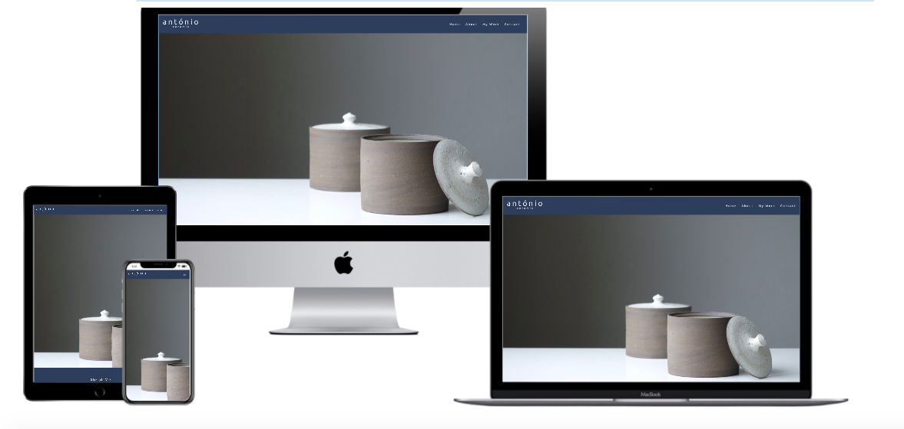

# antónio ceramic

### MS1 -User-Centric Frontend Development - Code Institute

This project was developed for a portuguese ceramic author. The author's intent is to expand the business to the international market as portuguese ceramic is so popular all around the world. The ultimate goal is to turn this project into a online store, written in at least 3 different languages - English, Swedish and Portuguese.

## Demo

Click <a href="https://mendesfsweden.github.io/milestone-project1/">here</a> for a live demo version of this project.

## UX

Focus on providing the necessary information to the users using a simple, clean and intuitive design. 

## User Stories

After contacting via email/phone with some friends that are very interested in ceramic and are active buyers, i have put together a list of what they look for when entering a ceramic website:
<ul>
  <li>As a user, i want to know what is your target consumer.</li>
  <li>As a user, i want to be able to see samples of your work.</li>
  <li>As a user, i want to know about the prices.(will be availble once the categories in the "my work" section are finished)</li>
  <li>As a user, i want to reach out to you for more information, both via phone or email/message.</li>
</ul>

### Strategy

The main goal is to promote the author's work by creating an organized website that is easy, for both B2C and potencial B2B visitors, to navigate through. 

### Scope

The users will be able to see a major part of the author's work in the different categories. The social media links are also available as well as all the contact information at the bottom of the page.   

### Structure 

It's a one page project with multiple sections. The user can either scroll up and down or use the navigation bar (visible at all time) to move between the different sections. It contains a section with a brief description of the author, another where the products are available to be seen through the different categories and finally a contact area at the bottom that includes social media links.

### Skeleton

Wireframes developed with figma for this project:

<a href="https://github.com/mendesfsweden/milestone-project1/blob/master/assets/mockups/Desktop.pdf">Desktop Version</a> 
<a href="https://github.com/mendesfsweden/milestone-project1/blob/master/assets/mockups/Mobile.pdf">Mobile Version</a>

### Surface

Used only two different colors throughout the entire project in order to give it a uniform and clean design. The font used, Ubuntu, was a personal choice. It simple but still stylish.  

## Technologies

<ul>
  <li>HTML - was used create the website structure</li>
  <li>CSS - was used to style the HTML</li>
  <li>Bootstrap - was used for the website responsiveness </li>
  <li>Figma - was used to create the wireframe</li>
</ul>

## Features

A navigation bar is used in this project and it is visible at all times, as the user scrolls down the page. The navigation bar collapses on tablet screens and smaller into a button that extends vertically once clicked on.
This project uses the Parallax Scrolling effect to create a perception of depth as the user scrolls.

### Features Left to Implement

Develop the different categories in the "My Work" section. Ultimatelly, the goal is to turn this project into a online store. 

## Testing

All links were tested and work perfectly. Facebook and Linkedin links are redirected to each of the plattforms home page while the Instagram link will open "antónio-ceramic" Instagram account. The "Send" button located in the contact section will take the user back to the home section, as well as all the different categories in the "My Work" Section.

This project was tested on Chrome, Safari, Internet Explorer, iOS devices (iPhone Xs and Ipad) and Android (Huawei P30). 

The navigation bar works perfectly in all screens/browsers.

## Bugs

### Background image on iOS devices

Background images, when manipulated (e.g. position:fixed), do not work well on iOS devices. The images become too big for the screen so  can only be seen partially and with a terrible quality. Solution was based on another Github colaborator page - the link can be found at the bottom of this readme file in the Acknowledgments section.

#### HTML/CSS Validation

<a href="https://validator.w3.org/" target="_blank">W3C HTML Validator:<a/> Used it to check the site's HTML document markup validity and it's functionality.  
<a href="https://jigsaw.w3.org/css-validator/" target="_blank">W3C CSS Validator:<a/> Used it to check the site's CSS document markup validity and it's functionality. 

## Deployment

The project is hosted at GitHub, directly from the master branch. For that reason, any new changes commited will update the project automatically.  

## Credits

### Content

All content on this project was written by me.

### Media

All images are from the free stock image library <a href="https://unsplash.com" target="_blank">Unsplash</a>.

### Acknowledgements

The Parallax Scrolling effect was suggested by my mentor. It can be found on w3schools.com - <a href="https://www.w3schools.com/howto/howto_css_parallax.asp">Link.</a>

Fixing the background image issue on iOS. It can be found on another colaborator Github page - <a href="https://github.com/thesved/fixed-cover-background">Link.</a>

